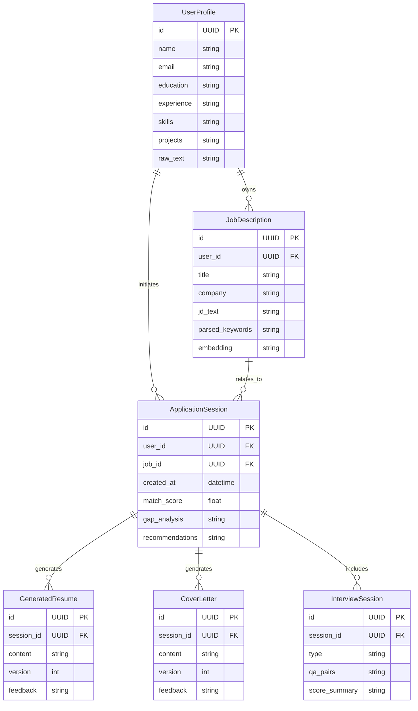

# 📊 JobPrep 系统信息架构文档

> 本文档描述了 JobPrep 系统围绕用户信息和求职流程设计的数据结构，结合 LLM 协作特性，提供适度结构化的方案。

---

## 🔧 总体结构概览

系统核心围绕两大主题构建：

1. **用户基本信息管理**：收集并结构化用户的个人背景、经历和技能；
2. **单次求职流程**（Job Application Session）：以 JD 为起点，包含匹配分析、简历定制、模拟面试与反馈等流程。

---

## 🧩 数据实体说明

### 1. `UserProfile`

| 字段 | 类型 | 说明 |
|------|------|------|
| `id` | UUID | 用户唯一标识 |
| `name` | string | 用户姓名 |
| `email` | string | 用户邮箱 |
| `education` | JSON | 教育经历 |
| `experience` | JSON | 工作经历 |
| `skills` | list | 技能清单 |
| `projects` | JSON | 项目经历 |
| `raw_text` | text | 粘贴的原始简历内容（供 LLM 使用） |

---

### 2. `JobDescription`

| 字段 | 类型 | 说明 |
|------|------|------|
| `id` | UUID | JD 唯一标识 |
| `user_id` | UUID | 所属用户 |
| `title` | string | 职位名称 |
| `company` | string | 公司名称 |
| `jd_text` | text | 原始 JD 文本 |
| `parsed_keywords` | list | 结构化提取的关键词 |
| `embedding` | vector | 向量表示（用于匹配） |

---

### 3. `ApplicationSession`

| 字段 | 类型 | 说明 |
|------|------|------|
| `id` | UUID | 会话标识 |
| `user_id` | UUID | 用户标识 |
| `job_id` | UUID | JD 标识 |
| `created_at` | datetime | 创建时间 |
| `match_score` | float | 匹配分数 |
| `gap_analysis` | text | 匹配差距说明 |
| `recommendations` | text | 补充建议（学习、经验等） |

---

### 4. `GeneratedResume` & 5. `CoverLetter`

| 字段 | 类型 | 说明 |
|------|------|------|
| `id` | UUID | 唯一标识 |
| `session_id` | UUID | 所属 Session |
| `content` | text | Markdown 或文本格式 |
| `version` | int | 版本号 |
| `feedback` | text | 用户或 LLM 给出的改进建议 |

---

### 6. `InterviewSession`

| 字段 | 类型 | 说明 |
|------|------|------|
| `id` | UUID | 面试记录 |
| `session_id` | UUID | 所属 Session |
| `type` | enum | `soft` 或 `tech` |
| `qa_pairs` | list | 问答对数组 |
| `score_summary` | text | 表现评估（LLM 生成） |

---

## 🧠 结构设计考虑：与 LLM 协作的平衡点

| 维度 | 设计意图 |
|------|----------|
| 💡 保留原始文本 | 支持语义理解与重新生成（简历、分析） |
| 📐 适度结构化 | 方便字段定位、数据回显与版本控制 |
| 🧩 可拓展性 | 每次 JD 创建新会话，支持多个职位投递 |
| 🧠 避免过度约束 | 不强依赖 rigid schema，允许 AI 自由生成内容 |

---

## 🧱 Mermaid ER 图

---

## 🔄 可扩展建议

- 支持文件上传与文本抽取；
- 引入 Chroma 向量索引支持相似 JD 推荐；
- 多 JD 并行分析与比较；
- 用户信息的版本管理与跟踪；

---

## ✅ 反思：是否覆盖用户旅程

本架构基于最新用户旅程完整构建，具有以下特点：

- **完整支持两大核心旅程：用户信息管理 & 求职流程；**
- **实体层面实现 JD 会话分离，多轮投递清晰可管理；**
- **既能满足 LLM 的自由生成，又支持结构化存储的历史记录与追踪；**

总体来看，该数据架构**结构清晰、扩展性强、语义友好、开发落地性好**，可直接进入后续 API 与前后端开发阶段。
