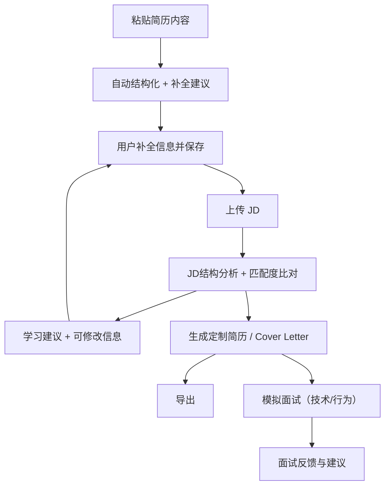

# 🎯 JobPrep 用户旅程设计（User Journey Driven）

本系统从“用户求职”的实际过程出发，围绕两大主线展开用户旅程设计：

- **主线一：用户基础信息建立与完善**
- **主线二：一次 JD 驱动的求职流程**

---

## 🔹 主线一：用户基础信息建立与完善

一次性或低频操作，目的是建立用户的长期求职档案，支撑所有后续求职行为。

### 基础信息收集用户操作流程

1. 用户首次进入系统，粘贴简历文本（TXT/Markdown）或逐项填写信息。
2. 系统通过 AI 提问，引导用户补全以下结构化信息：
    - 基本信息（姓名、邮箱、LinkedIn 等）
    - 教育背景
    - 工作经历（支持项目拆分）
    - 技能列表（语言、框架、工具等）
    - 证书与奖项
3. 用户可随时进入 Profile 页面进行补充或修改。

**特点：**

- 跨 JD 共用，不随求职目标变化
- 数据量有限，长期存储
- 可用于推荐匹配岗位、生成基础简历模板

---

## 🔸 主线二：一次 JD 驱动的求职流程

每上传一份 JD，系统开启一次完整的定制化求职辅助流程，包含分析、生成、模拟面试等。

### 求职流程用户操作流程

1. 上传或粘贴 JD 文本（支持 TXT/Markdown）。
2. 系统进行 JD 分析：
    - 抽取职位关键词、技能要求、经验需求。
3. 系统与用户档案比对，发现差距：
    - 给出学习建议（skills / projects）。
    - 提出补充建议（完善经历）。
4. 系统生成以下内容：
    - 针对 JD 的定制化简历草稿。
    - 求职信草稿。
5. 用户进行模拟面试训练：
    - 行为面试（STAR 模型）。
    - 技术面试（按岗位定制）。
6. AI 提供评语与改进建议，供用户练习优化。

**特点：**

- 每个 JD 独立建档
- 产出内容包含：
  - JD 分析结构数据
  - JD 匹配建议
  - 简历与求职信版本
  - 模拟面试记录

---

## 🧩 详细用户旅程分阶段说明

### 1. 用户信息收集与完善（基本简历构建）

**目标：** 构建一份完善的个人信息库（简历基础数据），为后续匹配、优化、生成提供基础。

**流程：**

1. 进入系统，无 JD，无任务。
2. 用户粘贴自己的简历内容：
    - 支持纯文本、Markdown 格式。
    - 不支持 PDF（避免解析复杂性）。
    - 推荐模板或示例引导用户粘贴完整内容。
3. 系统结构化解析内容：
    - 自动识别并分类：工作经历 / 教育经历 / 技能 / 项目 / 证书等。
    - 检查遗漏字段或信息不完整处，生成待补充建议。
4. 用户与系统交互补全信息：
    - 类似“简历医生”Agent，逐项补问。
    - 引导用户补全：职责描述、成果量化、时间范围等。
5. 保存用户基本信息：
    - 储存在本地或内存数据库（初期不做持久化）。
    - 用户可随时“重新编辑”或“更新信息”。
    - 可作为多个 JD 定制简历的基础资料。

> **说明**：此阶段仅围绕用户自身展开，与岗位无关，类似简历库建设。

---

### 2. JD 上传与分析（匹配与提升）

**目标：** 上传职位 JD，分析与自身匹配度，识别短板，制定补强策略。

**流程：**

1. 用户粘贴一份 JD（职位描述）：
    - 支持中英文 JD。
    - 建议格式为 Markdown 或 txt，避免上传复杂文档。
2. 系统解析 JD：
    - 提取岗位职责、关键技能、学历要求、工具要求等。
    - 可通过 DashScope 调用 qwen-turbo 分析结构。
    - 输出结构化字段，例如：必备技能 / 加分项 / 职责关键词 / 公司文化。
3. 简历匹配分析：
    - 系统将用户基本信息与 JD 进行比对。
    - 输出匹配度评分 + 不匹配项列表。
    - 给出建议项的分类：“可补强技能 / 描述优化 / 无需修改”。
4. 用户选择是否跟进学习：
    - 系统扮演“学习建议 Agent”，提供学习建议（例如课程 / 项目补充方案 / 自我介绍训练）。
    - 用户可选择调整或完善信息（回到阶段一）。

> **说明**：此阶段为“自我对照 JD”过程，强调反馈、建议、强化，不强制修改。

---

### 3. 简历与 Cover Letter 生成（定制化文案）

**目标：** 输出一份专门为目标岗位量身定制的简历和求职信。

**流程：**

1. 点击“生成简历”按钮：
    - 基于用户基本信息 + 当前 JD。
    - 可选模板样式（如 STAR 项目法，简洁型，技术导向型）。
2. 点击“生成 Cover Letter”按钮：
    - 生成一段专业、岗位匹配的求职信，自动包含职位关键词和亮点对齐。
3. 预览 + 编辑模式：
    - 用户可直接在前端修改。
    - 支持导出为 `.md` 或 `.txt` 文件。

> **说明**：此阶段重点是生成内容，用于投递简历或链接到其他系统。

---

### 4. 模拟面试（交互训练）

**目标：** 熟悉面试流程，提前练习可能问题，提升表达与思维能力。

**流程：**

1. 点击“开始模拟面试”，选择模式：
    - 技术面试（技能问题）。
    - 行为面试（沟通与经历）。
    - 英文面试（可选）。
2. 系统生成面试题目：
    - 来源于 JD + 用户简历。
    - 使用 DashScope 调用生成。
    - 支持追问与多轮问答（有限轮次）。
3. 用户回答后系统点评：
    - 指出回答中可以优化的地方。
    - 提出 STAR 框架建议。
    - 可生成“标准参考答案”。
4. 用户查看反馈总结：
    - 面试表现打分（可选）。
    - 可导出问答记录。

> **说明**：此阶段主要帮助练习，体现 Agent 的陪伴与迭代特性。

---

## 🧠 信息结构简图



---

### 用户-岗位-内容关系结构

```text
[UserProfile]
    |
    |————→ [JD_1]
    |         ├─ Resume v1
    |         ├─ CoverLetter
    |         └─ InterviewRecord
    |
    |————→ [JD_2]
              ├─ Resume v1, v2
              ├─ CoverLetter
              └─ InterviewRecord
```
